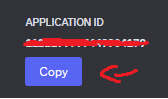
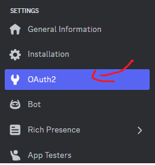

# VoidType

## The Void - Это просто простой бот !
- The Void Bot нацелен на увеличение опыта автора в JavaScript и TypeScript.
- К тому же у The Void по тихоньку появляется история и, возможно, мини сюжет.

### Как разбираться в коде ?
- В коде разобраться не сложно, много функций разбито по файлам, конечно, комментарий нет, но все названия переменных и функций имеют конкретное значение, иногда встречаются сокращения, но обычно их сопровождают комментарии автора.

### Как создать своего бота ?
- Для начала нужно создать бота на [discord.dev](https://discord.com/developers/applications) сайте.

<picture>
    
</picture>

- После берем id бота.

<picture>
    
</picture>

- После id берем токен, для этого переходим в bot.

<picture>
    
</picture>

- Когда Вы все сделали, можно запускать бота на сервер. Для этого переходим в OAuth2 и выбираем в OAuth2 URL Generator application.commands и копируем

<picture>
    
</picture>

<picture>
    
</picture>

- В итоге, переходим по ссылке, которую Вы скопировали и бот у нас на сервере.
- В коде вы можете разобраться сами, напишу кратко, если Вы кодите на JavaScript:
- Пишите в командной строке:

```
npm init
npm i
npm i discord.js
```

- Создавайте config.json файл и впишите в него:

```js
{
    "token": "YOUR-TOKEN",
    "id": "YOUR-APP-ID"
}
```

- Создайте index.js файл и впишите в него:

```js
const {
	Client,
	Collection,
	Events,
	GatewayIntentBits,
	Partials,
} = require('discord.js');

const config = require('./config.json')

/* 

YOUR-IMPORT-HERE

*/

const client = new Client({
	intents:
	[
		GatewayIntentBits.Guilds,
		GatewayIntentBits.GuildMembers,
		GatewayIntentBits.GuildMessages,
		GatewayIntentBits.DirectMessages,
		GatewayIntentBits.MessageContent,
		GatewayIntentBits.GuildVoiceStates,
		GatewayIntentBits.GuildPresences
	],
	partials:
	[
		Partials.Channel
	],
});

/* 

YOUR-CODE-HERE

*/

client.login(config.token);
```