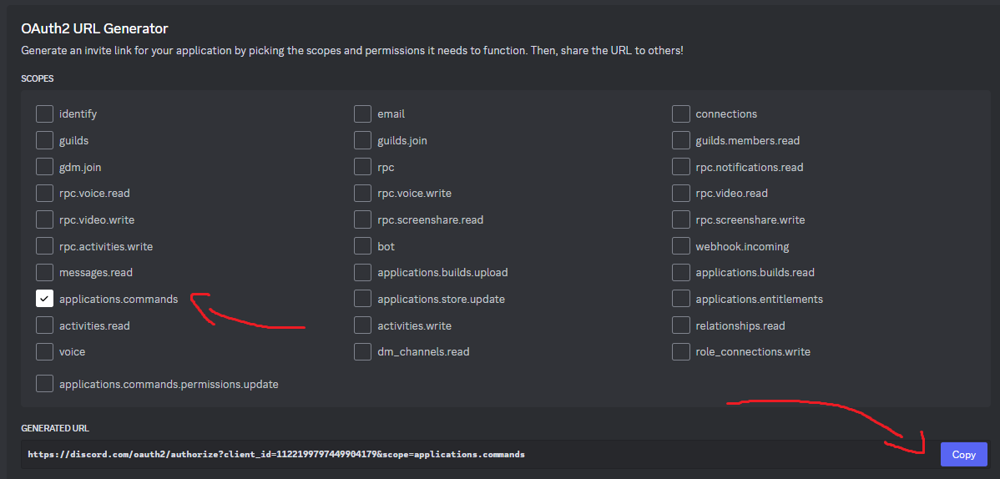

# VoidType

## Дополнительно
- [Система коммитов](./docs/help/readme-files/docs/commit.system.md)
- [Инструкция по установке](./docs/help/readme-files/install/instruction.md)
- [Инструкция по запуску](./docs/help/readme-files/start/instruction.md)

## The Void - Это просто простой бот !
- The Void Bot нацелен на увеличение опыта автора в JavaScript и TypeScript.
- К тому же у The Void по тихоньку появляется история и, возможно, мини сюжет.

### Как разбираться в коде ?
- В коде разобраться не сложно, много функций разбито по файлам, конечно, комментарий нет, но все названия переменных и функций имеют конкретное значение, иногда встречаются сокращения, но обычно их сопровождают комментарии автора.

### Как создать своего бота ?
- Для начала нужно создать бота на [discord.dev](https://discord.com/developers/applications) сайте.

<picture>
    
</picture>

- После берем id бота.

<picture>
    
</picture>

- После id берем токен, для этого переходим в bot.

<picture>
    
</picture>

- Когда Вы все сделали, можно запускать бота на сервер. Для этого переходим в OAuth2 и выбираем в OAuth2 URL Generator application.commands и копируем

<picture>
    
</picture>

<picture>
    
</picture>

- В итоге, переходим по ссылке, которую Вы скопировали и бот у нас на сервере.
- В коде вы можете разобраться сами, напишу кратко:
1. Можете скопировать данный репозиторий командой:

```
git clone https://github.com/FOCKUSTY/VoidType.git
```

- И загрузить все библиотеки:

```
npm i
```

- Дальше найдите `config.example.json`
- Можете просто убрать `.exapmle` из название и заметить на Ваши значения.
- Если Вы не можете разобраться сами, можете перейти в [подробную инструкцию](./docs/help/readme-files/install/instruction.md).

2. Пишите в командной строке:


```
npm init
npm i
npm i discord.js
```

- Создайте `.env` файл и впишите в него следующее, заменив `YOUR_DISCORD_CLIENT_TOKEN` и `YOUR_DISCORD_CLIENT_ID` на токен и id бота соответственно:

```
CLIENT_TOKEN=YOUR_DISCORD_CLIENT_TOKEN
CLIENT_ID=YOUR_DISCORD_CLIENT_ID
```

# Если Вы кодите на JavaScript:

- Создайте index.js файл и впишите в него:

```js
const { Client, GatewayIntentBits, Partials } = require('discord.js');
const { config } = require("dotenv");

config("./.env"); // или "../.env", смотря где у Вас расположен .env файл

/* 

YOUR-IMPORT-HERE

*/

const client = new Client({
	intents: [
		GatewayIntentBits.Guilds,
		GatewayIntentBits.GuildMembers,
		GatewayIntentBits.GuildMessages,
		GatewayIntentBits.DirectMessages,
		GatewayIntentBits.MessageContent
	],
	partials: [
		Partials.Channel
	],
});

/* 

YOUR-CODE-HERE

*/

client.login(token);
```

# Если Вы кодите на TypeScript:

- Создайте `index.ts` файл и впишите в него:

```ts
import { Client, GatewayIntentBits, Partials } from 'discord.js';
import { config } from "dotenv";

config("./.env"); // или "../.env", смотря где у Вас расположен .env файл

/* 

YOUR-IMPORT-HERE

*/

const client: Client = new Client({
	intents: [
		GatewayIntentBits.Guilds,
		GatewayIntentBits.GuildMembers,
		GatewayIntentBits.GuildMessages,
		GatewayIntentBits.DirectMessages,
		GatewayIntentBits.MessageContent,
		GatewayIntentBits.GuildVoiceStates,
		GatewayIntentBits.GuildPresences
	],
	partials: [
		Partials.Channel
	],
});

/* 

YOUR-CODE-HERE

*/

client.login(token);
```

- Создайте `tsconfig.json`:
```json
{
    "compilerOptions": {
        "target": "ES2024",
        "module": "CommonJS",
        "rootDir": "./",
        "outDir": "./dist", // можно назвать build.
        "removeComments": true,
        "resolveJsonModule": true,
        "esModuleInterop": true,
        "forceConsistentCasingInFileNames": true,
        "strict": true,
        "skipLibCheck": true, 
		"paths": {
			// "название-пути": [ "ваши-пути", "еще-один-путь" ]
			// "папка-и-все-файлы-в-ней/*": [ "еще-папка/*", "и-еще/*", "а-это-файл.да" ]
		}
	},
	"include": ["./**/*.ts"], // БЕРЕМ ВСЕ TS ФАЙЛЫ, ЧТО НАХОДЯТСЯ В ПРОЕКТЕ УХАХХАХАХАХ.
	"exclude": [ "node_modules", "dist" ] // И не забываем про...
}
```

- Добавьте в `package.json`:
```json
  "devDependencies": {
    "@types/node": "^20.16.1",
    "dotenv": "^16.4.5",
    "nodemon": "^3.1.7",
    "ts-node": "^10.9.2",
    "tsc": "^2.0.4",
    "tsc-alias": "^1.8.10",
    "tsconfig-paths": "^4.2.0",
    "typescript": "^5.5.4"
}
```

- И впишите в терминал:
```
npm i 
```