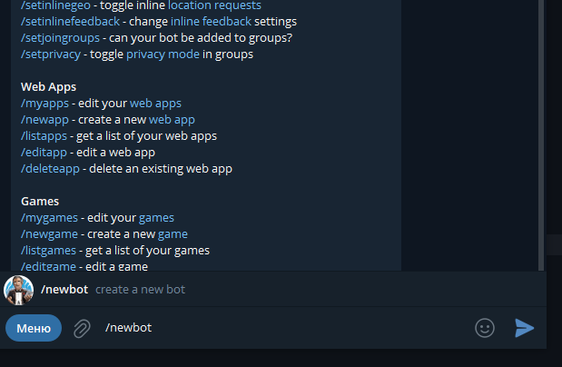
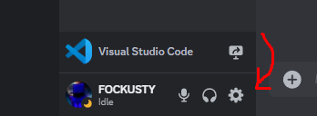
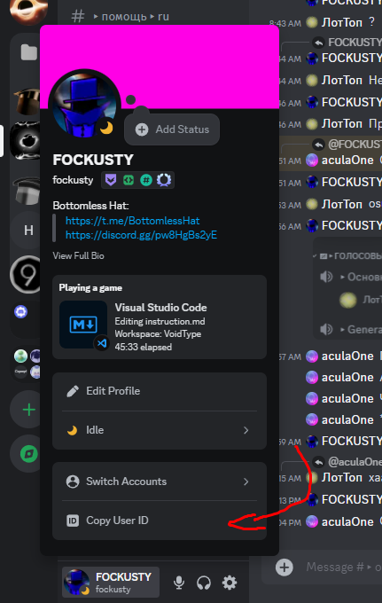
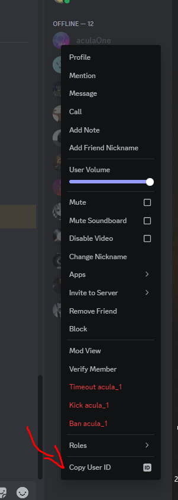

# Instructions
## Instructions for cloning the repository and further installation

- Clone the repository.

```
git clone https://github.com/FOCKUSTY/VoidType.git
```

- And download all the libraries:

```
npm i
```

- Then find `config.example.json`.
- You can simply remove `.exapmle` from the name and note your values.

- We get such a `config.json` file.

```json
{
    "clientToken": "YOUR-TOKEN",
    "clientId": "BOT-ID",

    "telegramToken": "YOUR-TELEGRAM-TOKEN",

    "changeLogTelegramGroupId": "YOUR-TELEGRAM-GROUP-ID (link)",
    "changeLogDiscordChannelId": "YOUR-DISCORD-CHANNEL-ID",

    "guildId": "MAIN-GUILD-ID",
    "authorId": "YOUR-ID",

    "aculaOneId": "This is mine, you can change this"
}
```

### token & bot id

- Then take the bot id.

<picture>
    
</picture>

- After the id, take the token, for this, go to bot.

<picture>
    
</picture>

- Then insert the received values ​​into `config.json`.

### telegram token

- Go to telegram.
- Find the BotFather bot or follow the [link](https://t.me/BotFather).
- Click the START button

<picture>
    
</picture>

- Enter the command /newbot

<picture>
    
</picture>

- Write the bot name in the following format: `BOT-NAME_bot`.

<picture>
    
</picture>

- Then copy the bot token that was given to us and paste it into `config.json`.

### changeLogTelegramGroupId & changeLogDiscordChannelId & guildId & authorId

- This is where it gets scary.
- First, get `channelId` from discord.
- To do this, go to the settings.

<picture>
    
</picture>

- Go to advanced settings.

<picture>
    
</picture>

- Enable developer mode.

<picture>
    
</picture>

- Exit settings and right-click on any chat, then copy channel id.

<picture>
    
</picture>

- Now copy authorId and guildId.

<picture>
    
</picture>

<picture>
    
</picture>

- About aculaOneId, this is my colleague at work, and, one might say, a friend, so you can copy your friend's id or even remove it from `config.json`. Further actions are up to you.

<picture>
    
</picture>

- What about the telegram group, you can just copy the link to the group.
- You can also write through the @ symbol, here is an example: `@BottomlessHat`.

<picture>
    
</picture>

- Congratulations, we got all the values, now you can insert them into `config.json` !
- You can read [the launch instructions](../start/instruction-en.md)