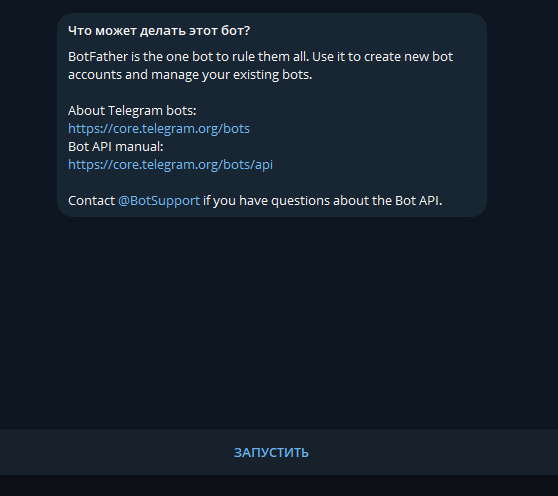
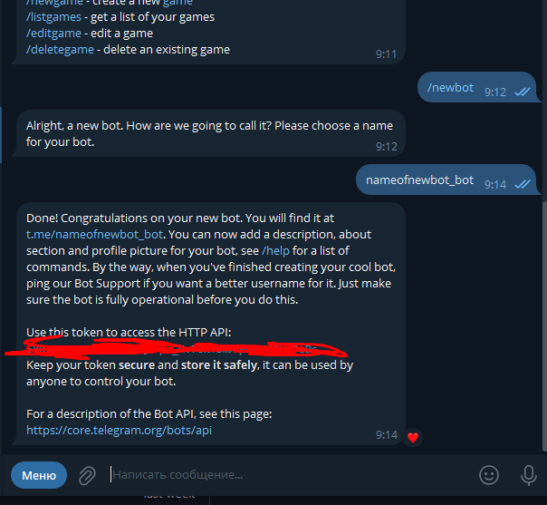
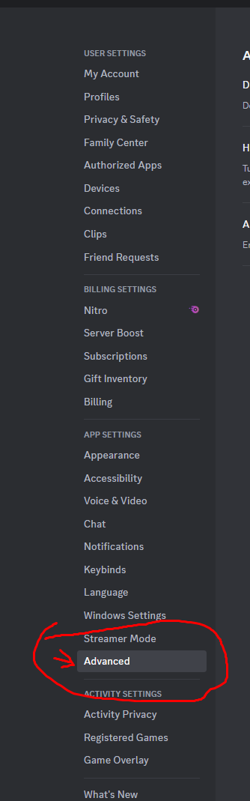
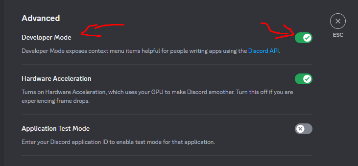
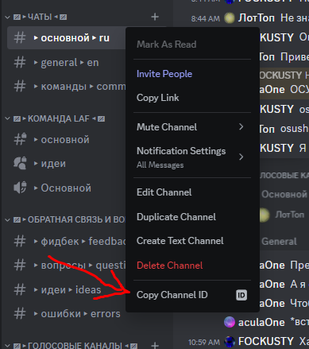
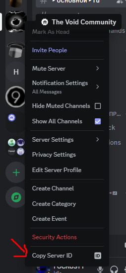
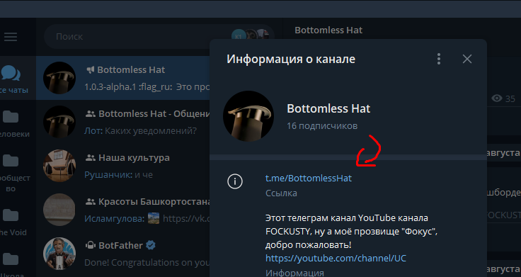

# Инструкция
## Инструкция по клонированию репозитория и дальнейшей установке

- Склонируйте репозиторий.

```
git clone https://github.com/FOCKUSTY/VoidType.git
```

- И загрузить все библиотеки:

```
npm i
```

- Дальше найдите `config.example.json`
- Можете просто убрать `.exapmle` из название и заметить на Ваши значения.

- Мы получаем такой `config.json` файл.

```json
{
    "clientToken": "YOUR-TOKEN",
    "clientId": "BOT-ID",
    
    "telegramToken": "YOUR-TELEGRAM-TOKEN",

    "changeLogTelegramGroupId": "YOUR-TELEGRAM-GROUP-ID (link)",
    "changeLogDiscordChannelId": "YOUR-DISCORD-CHANNEL-ID",

    "guildId": "MAIN-GUILD-ID",
    "authorId": "YOUR-ID",
    
    "aculaOneId": "This my, you can change this"
}
```

### token & id бота

- После берем id бота.

<picture>
    
</picture>

- После id берем токен, для этого переходим в bot.

<picture>
    
</picture>

- После вставляем полученный значения в `config.json`.

### telegram token

- Заходим в telegram.
- Находим бота BotFather или переходим по [ссылке](https://t.me/BotFather).
- Нажимаем на кнопку ЗАПУСТИТЬ

<picture>
    
</picture>

- Вводим команду /newbot

<picture>
    
</picture>

- Пишем имя бота в следующем формате: `НАЗВАНИЕ-БОТА_bot`.

<picture>
    
</picture>

- После копируем token бота, который нам выдали и вставляем в `config.json`.

### changeLogTelegramGroupId & changeLogDiscordChannelId & guildId & authorId

- Вот здесь страшно.
- Для начала получем `channelId` из discord.
- Для этого заходим в настройки.

<picture>
    
</picture>

- Переходим в расширенный настройки.

<picture>
    
</picture>

- Включаем режим разработчика.

<picture>
    
</picture>

- Выходим из настроек и нажимаем правой кнопкой по любому чату, после копируем id канала.

<picture>
    
</picture>

- Теперь скопируем authorId и guildId.

<picture>
    
</picture>

<picture>
    
</picture>

- Насчет aculaOneId, это мой коллега по работе, и, можно сказать, друг, так что Вы можете скопировать id своего друга или вообще убрать это из `config.json`. Дальнейшие действия за Вами.

<picture>
    
</picture>

- Что насчет telegram группы, Вы можете просто скопировать ссылку на группу.
- Также можно написать через символ @, вот пример: `@BottomlessHat`.

<picture>
    
</picture>

- Поздравляем, мы взяли все значения, теперь можете их вставлять в `config.json` !